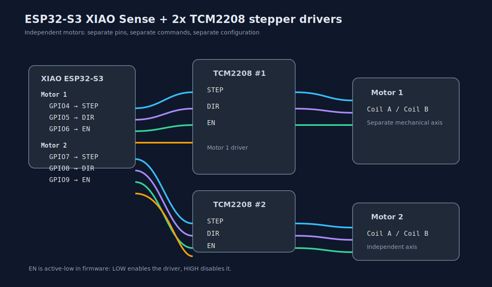
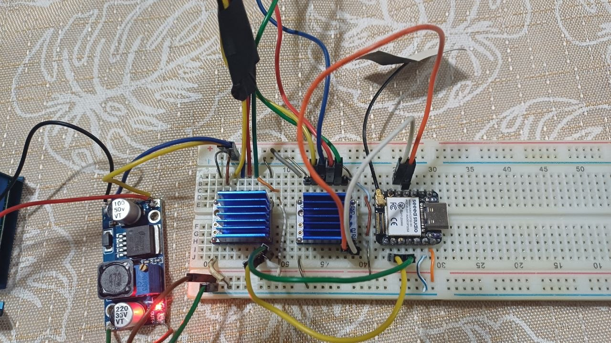
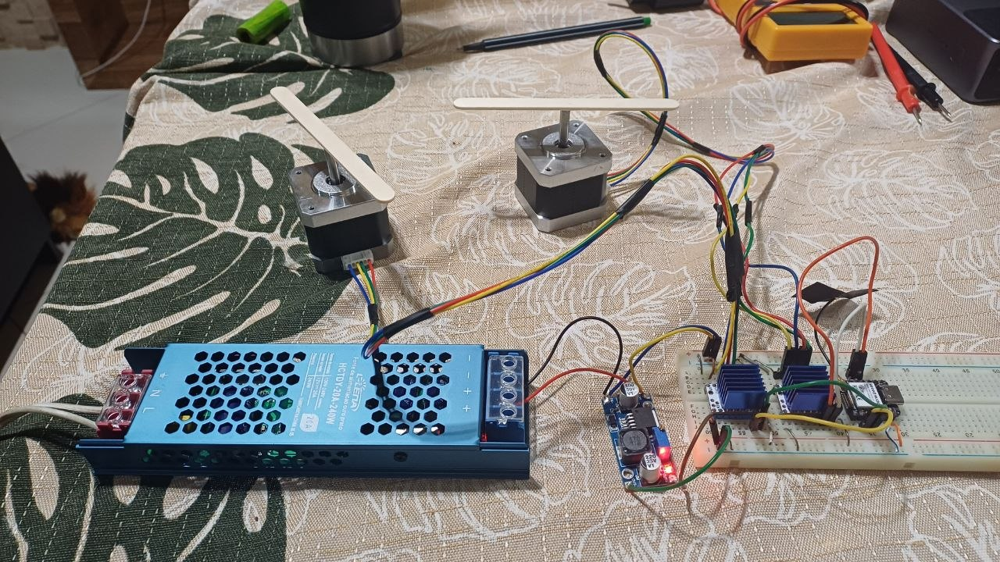

# esp32-step-motor

ESP-IDF firmware for **two independent TMC2208 stepper drivers** running on a **Seeed XIAO ESP32S3 Sense**.



## Real hardware setup

| Prototype view 1 | Prototype view 2 |
|---|---|
|  |  |

The project provides:

- hardware-generated STEP signal using PWM/LEDC
- a built-in HTTP server
- a local web control page
- a JSON API for automation and integrations
- manual jog control for each motor
- automatic back-and-forth motion for each motor
- motion profiles based on **time** or **steps**
- independent configuration and commands per motor
- servo position control with configurable 0° to 180° moves
- Wi-Fi configuration from the web UI
- an **emergency AP** for recovery and local access

---

## Hardware defaults

The default pins are defined in `main/main.c`:

| Actuator | Signal | GPIO / mode |
|---|---|---|
| Motor 1 | STEP | GPIO4 |
| Motor 1 | DIR | GPIO5 |
| Motor 1 | EN | GPIO6 |
| Motor 2 | STEP | GPIO7 |
| Motor 2 | DIR | GPIO8 |
| Motor 2 | EN | GPIO9 |
| Servo | PWM | GPIO3 @ 50Hz |

The TMC2208 enable pin is **active-low** by default.

If you need different pins, edit `main/main.c` and rebuild.

---

## How it works

The firmware boots, starts the motor control logic, and brings up Wi-Fi.

It supports two Wi-Fi roles:

- **AP mode**: the board creates its own access point
- **STA mode**: the board joins your router as a client

The key design point is this:

> The emergency AP is kept available so you do not lose access to the device.

That means you can always recover the board from `http://192.168.4.1/`, even if the STA network is misconfigured.

---

## Wi-Fi modes

### 1) AP local / emergency

Use this when you want direct access to the board.

- the board exposes its own Wi-Fi network
- web access is available at `http://192.168.4.1/`
- ideal for setup, debugging, and recovery
- useful when no router is available

### 2) STA mode

Use this when you want the board to join your existing Wi-Fi network.

- enter your router SSID and password in the web page
- the board connects as a client
- the board keeps the emergency AP active for recovery
- once connected, you can reach it from your LAN IP

### Important behavior

- Wi-Fi settings are stored in **NVS**
- the configuration survives reboot
- the web page shows the current Wi-Fi status and IP addresses

---

## Web UI

Open one of these addresses:

- `http://192.168.4.1/` when using the emergency AP
- the board's LAN IP when STA is connected

The web page lets you:

### Motion settings

- choose the motion profile: `time` or `steps`
- set `rpm`
- set `move_time_ms`
- set `move_steps`
- set `pause_ms`
- set `dir_setup_us`
- apply settings separately to **Motor 1** and **Motor 2**

### Wi-Fi settings

- choose the Wi-Fi mode
- enter router SSID
- enter router password
- save the Wi-Fi configuration

### Manual control

- `Jog forward` / `Jog reverse` / `Stop` / `Start auto` / `Stop auto` for each motor
- servo section with direct angle control from 0° to 180°

### Live status

The page also shows:

- motor 1 state
- motor 2 state
- RPM for each motor
- active motion profile for each motor
- current Wi-Fi mode
- AP status
- STA connection status
- current IP addresses
- pending action state per motor

---

## API endpoints

Available endpoints:

- `GET /api/health`
- `GET /api/state`
- `POST /api/config`
- `POST /api/control`
- `GET /api/servo`
- `POST /api/servo`
- `GET /api/wifi`
- `POST /api/wifi`

The motion endpoints accept a `motor` field (`1` or `2`) so each actuator can be configured and commanded independently.

---

## `GET /api/state`

Returns the current motor and Wi-Fi state.

Example:

```json
{
  "profile": "time",
  "auto_mode": false,
  "running": false,
  "activity": "idle",
  "pending_action": "none",
  "wifi_mode": "ap",
  "wifi_ssid": "MyNetwork",
  "wifi_sta_connected": false,
  "wifi_ap_ip": "192.168.4.1"
}
```

---

## `POST /api/config`

Use this to update motion parameters.

Example body:

```json
{
  "profile": "steps",
  "step_period_us": 1000,
  "move_time_ms": 5000,
  "move_steps": 200,
  "pause_ms": 1000,
  "dir_setup_us": 20
}
```

### Fields

- `profile`: `time` or `steps`
- `step_period_us`: STEP pulse period in microseconds
- `move_time_ms`: move duration when using the `time` profile
- `move_steps`: move length when using the `steps` profile
- `pause_ms`: pause between direction changes
- `dir_setup_us`: delay used when changing direction

---

## `GET /api/wifi`

Returns the current Wi-Fi configuration and state.

Example:

```json
{
  "mode": "sta",
  "ssid": "MyNetwork",
  "sta_connected": true,
  "sta_ip": "192.168.1.50",
  "ap_started": true,
  "ap_ip": "192.168.4.1",
  "emergency_ap": true
}
```

---

## `POST /api/wifi`

Use this to configure the Wi-Fi role and router credentials.

Example body:

```json
{
  "mode": "sta",
  "ssid": "MyNetwork",
  "password": "my_password"
}
```

### Notes

- `mode` can be `ap` or `sta`
- `ssid` and `password` are used for STA mode
- the emergency AP remains active for recovery

---

## `POST /api/control`

Use this to control the motor manually or start/stop the automatic mode.

Example actions:

- `forward`
- `reverse`
- `stop`
- `auto_start`
- `auto_stop`

Example:

```json
{
  "action": "forward"
}
```

---

## Home Assistant integration

The HTTP API is easy to integrate with Home Assistant using `rest_command`.

Example:

```yaml
rest_command:
  step_motor_forward:
    url: http://192.168.4.1/api/control
    method: POST
    content_type: application/json
    payload: '{"action":"forward"}'

  step_motor_reverse:
    url: http://192.168.4.1/api/control
    method: POST
    content_type: application/json
    payload: '{"action":"reverse"}'

  step_motor_stop:
    url: http://192.168.4.1/api/control
    method: POST
    content_type: application/json
    payload: '{"action":"stop"}'

  step_motor_auto_start:
    url: http://192.168.4.1/api/control
    method: POST
    content_type: application/json
    payload: '{"action":"auto_start"}'

  step_motor_auto_stop:
    url: http://192.168.4.1/api/control
    method: POST
    content_type: application/json
    payload: '{"action":"auto_stop"}'
```

If the ESP32 is connected to your router, replace `192.168.4.1` with the device LAN IP.

---

## Build

From the project root:

```bash
source /root/esp-idf/export.sh
idf.py set-target esp32s3
idf.py build
```

---

## Flash

Example:

```bash
idf.py -p /dev/ttyACM0 flash monitor
```

Adjust the serial port for your environment.

---

## Notes

- The STEP signal is generated by hardware PWM, so the firmware does not depend on heavy software loops.
- The web page refreshes status periodically, but it keeps editable fields safe while you type.
- The emergency AP is intentionally preserved to avoid lockout.

---

## Project goal

This firmware is intended to be:

- simple to use
- stable during long runs
- easy to integrate with automation
- safe to recover if Wi-Fi configuration changes go wrong
